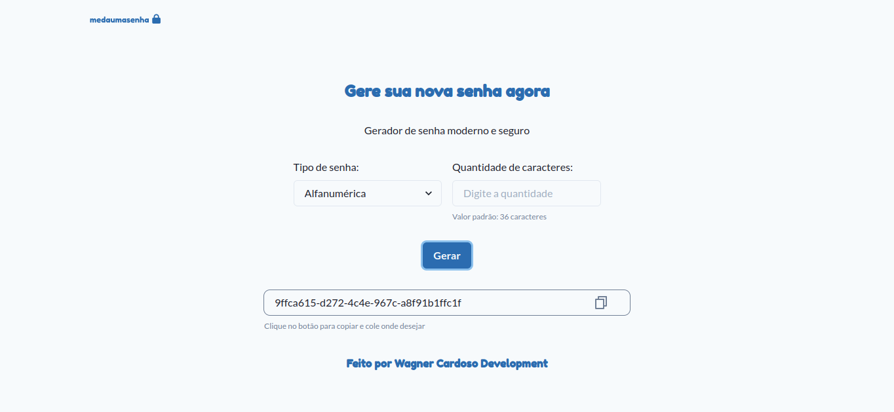

# medaumasenha
- [Sobre](#sobre)
- [Preview](#preview)
- [Tecnologias](#techs)
- [Como usar](#como-usar)
- [Entre em contato](#contato)

<h2 id="about">Sobre</h2>

O app **medaumasenha** é um gerador de senhas. No site temos as seguintes opções de senha:
- alfanumérica: senha gerada com UUID;
- numérica: senha gerada com um número aleatório e tratamento de string;
O deploy foit feito na Vercel.

<h2 id="preview">Preview</h2>

Acesse o site [aqui](medaumasenha.vercel.app).




<h2 id="techs">Tecnologias</h2>

- React.js;
- Next.js;
- Vercel;

<h2 id="como-usar">Como usar</h2>

Para rodar o projeto na sua máquina, é preciso inicialmente instalar as bibliotecas que
estão no _package.json_:

```bash
# npm
npm install

#yarn
yarn install
```

Após, basta rodar o seguinte comando:

```bash
# npm
npm run dev

#yarn
yarn dev
```

Pronto. O projeto estará rodando na sua máquina.

Caso queira executar os testes, rode o seguinte comando:

```bash
# npm
npm run test

#yarn
yarn test
```

<h2 id="contact">Entre em contato</h2>

<div style="display: flex">
  <a href="https://www.linkedin.com/in/wagner-cardoso-dev">
    
  </a>
  <a href="mailto:wagnerdev01@gmail.com">
    
  </a>
</div>
